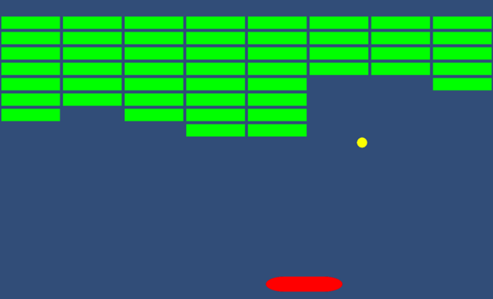
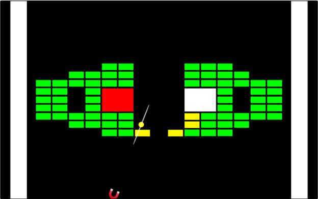
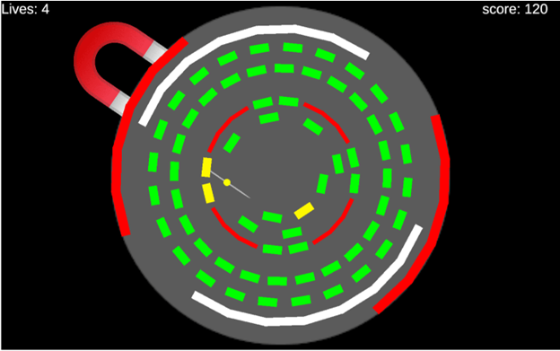

# Reflection on Breakout Prototypes

## Prototype 1: Getting The Basics

The first prototype was dedicated to programming a basic version of breakout before expanding upon it.  The purpose of this was not to experiment with anything new, but rather to become familiar with the basic mechanics, feel, and gameplay loop.

The only controls in a basic version of prototype are moving a paddle back and forth along the bottom of the screen.  I decided to implement 2 different methods of this movement, one using buttons, the other using the movement of the mouse.

[Play Breakout Prototype 1](https://mikegray31.github.io/game-dev-spring2025/builds/breakout-1/)

## Prototype 2: Magnetic Gameplay

The second prototype was used to experiment with a new system of controlling the ball.  One thing I noticed about the basic version of Breakout is that the player has very little control over the ball once it bounces away.  Early in the level, this is not a problem since the ball is almost guaranteed to hit one of the blocks.  But once there are only a few blocks left, it can be incredibly tedious to get that final hit.

To remedy this, I decided to entirely overhaul the way that the player interacts with the ball.  Instead of a “paddle” to bounce the ball off of, the player now controls a “magnet”.  Two buttons can be used to control whether the magnet pushes or pulls the ball.  By using these two functions in combination with the positions of the magnet and the ball, the player always has some degree of control over where the ball goes.

In playtesting several issues became prominent.  For one, there was no visual indication as to whether the player was pulling or pushing the ball, save for how the ball moved.  Another issue was that pulling and pushing the ball felt extremely “floaty”.   A third was the fact that the position of the magnet was limited the bottom edge of the screen, meaning that it could only really affect the ball vertically.  All three of these issues were addressed in the third prototype.

[Play Breakout Prototype 2](https://mikegray31.github.io/game-dev-spring2025/builds/breakout-2/)

## Prototype 3: Refinement

The third prototype had several refinements to fix the issues in the previous iteration.

First, the magnet could now move 360 degrees around the edge of the screen in a circle, enabling the player to have a fuller control over the direction that they affect the ball.  The layout of the bricks was also changed to a circular pattern to reflect this change.

Second, the push and pull functions were modified such that they have a “damping” effect on how the ball moves.  Instead of simply adding a force to the ball in the direction that it is being affected, the magnet now also partially dampens the movement of the ball perpendicular to the force being added.  This gives the ball a much tighter “turn radius” when the push or pull buttons are pressed.

Finally, red and blue indicators were added to the ball for the push and pull affects.  These indicators turn on and off depending on what function is being used.

[Play Breakout Prototype 3](https://mikegray31.github.io/game-dev-spring2025/builds/breakout-3/)

## Prototype 4: Refinement
