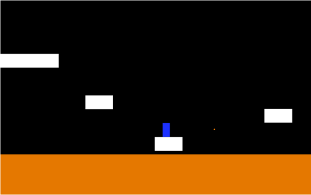
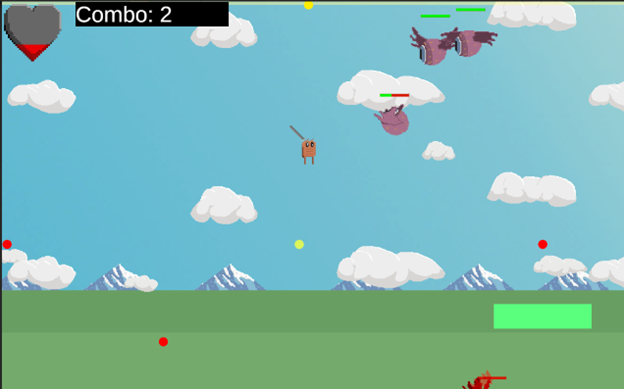
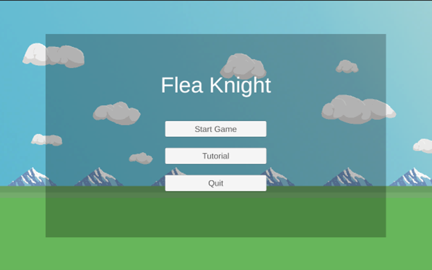
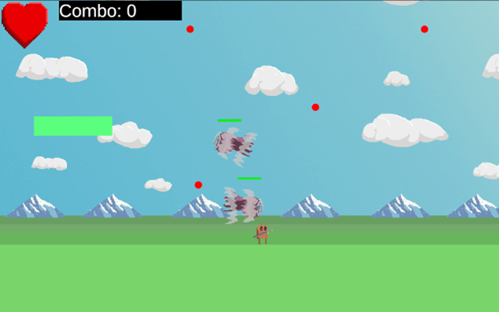

# Reflection on Breakout Prototypes

## Prototype 1: Getting The Basics

For this prototype, I kept it simple.  I had previously programmed a platformer before and I was able to bring over those mechanics to make a simple level.  This included controllable jump height depending on how long the jump button was held after an initial jump, a double jump, wall jumps, and coyote time.  I had to refine these all a little as my previous attempt was very basic.  Even with refinements, the wall-jump still had bugs in that even after you slid off the bottom of the wall, you would still perform a wall jump.

[Play Platformer Prototype 1](https://mikegray31.github.io/game-dev-spring2025/builds/platformer-1/)

## Prototype 2: Something Entirely Different

Due to circumstances, I was allowed to show off my progress on my Capstone for my second prototype, which was also a platformer with hack and slash elements.  While wall jumping is not implemented here, it does include 2 other mechanics: sword bouncing from Hollow Knight, where the player can get a small mini jump by swing downward and hitting an enemy/object and a move I currently call the Dash Finisher.  This mechanic allows players to get a burst of speed and damage an available active target within range.  Active targets include enemies that have had their health depleted, and certain floating objects that deactivate when struck and reactivate after a short period.  It should be noted that this move is the only way to kill enemies.  The Dash Finisher also recharges the player’s double jump.  It is built around the idea of defeating enemies in midair while keeping off the ground, reaching the point where you can chain together dash finishers.

I had to learn quite a bit to implement these mechanics.  There has been a lot of balancing jump and gravity values while fine tuning the hitboxes for enemies.   They still need refinement.

[Play Platformer Prototype 2](https://mikegray31.github.io/game-dev-spring2025/builds/platformer-2/)

## Prototype 3: Refinement

I spent the last few weeks refining some of the mechanics in my Capstone.  I added a title screen, some explanation of lore, a short tutorial level, and started on a new level. The mechanics have largely stayed the same, but I did refine them by adding some more "game feel" elements to them.  The sword animates during a dash finisher now, the player blinks red when they take damage, and there is a trail on the dash finisher to emphasize the movement.

I got some important feedback in both the previous playtest and a playtest a few days later in my capstone class. An important lesson I need to learn is that players will not naturally find the dash finisher button without any prompting.  They will continue to just swing the sword without using the dash finisher.  I need to convey the mechanic better.  One way I could do that is by giving them a visible prompt over the target to press the appropriate button.

[Play Platformer Prototype 3](https://mikegray31.github.io/game-dev-spring2025/builds/platformer-2/)

