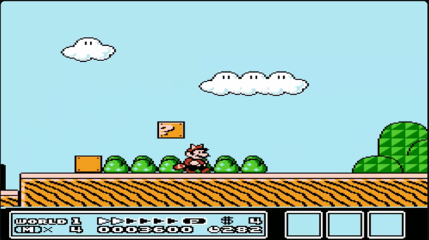
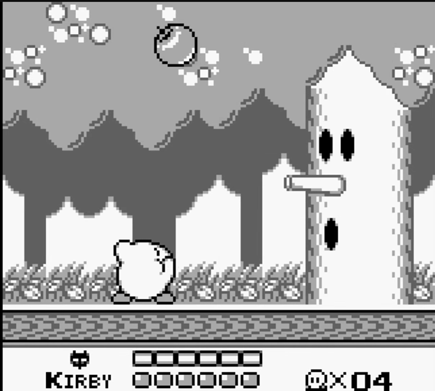
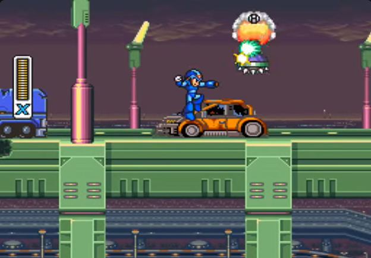

# Platformer Analysis

## Game 1: Super Mario Bros 3

### Ground Movement

In SMB3, ground movement was built to allow for variety.  Despite being on the NES, the game’s ground- based was not a constant walking speed.  Mario noticeably accelerates between his different speeds.  However, I would not describe it as “floaty”.  The acceleration is fast enough that the player still feels like they are well in control.  Mario also is able to accelerate to a run by holding the B-button.  Holding this long enough will play a sound and fill a power bar at the bottom of the screen. Once filled this bar can have a variety of effects, like enabling flight when a certain powerup is obtained, opening up secret areas, and other effects.  A big part of this game is built around the player finding ways to accelerate to their max run speed and keep it going to the end of the level.

### Jumping

SMB3’s jump allows for a great control.  The height of the jump can be controlled based on how long, the player holds the jump button.  Once the button is released, the gravity on Mario will increase and he will fall faster.  The faster Mario is moving horizontally, the higher he can jump.  Mario also keeps his horizontal momentum when he jumps as well.

### Level Design

One of the effects that movement has on the level design in SMB3 is that it causes the player to always be looking for flat areas where they can accelerate Mario to top speed.  Whenever the player finds one, it communicates to them that there is some opportunity for a shortcut or a secret area at the end of the path.  On the flipside, the game can also accommodate precise platforming due to the different speeds that Mario can move at.

## Game 2: Kirby's Dream Land

### Ground Movement

In a few words, simple and steady would describe KDL's ground movement.  Kirby only has one, fairly slow speed and nothing else.  This contributes to the game's easy and accessible nature.

### Jumping

The jump is a little more interesting.  One of the key features about KDL is the ability to have infinite "mini jumps" while Kirby is in the air.  In essence, there isn't a limit to how long Kirby can stay in the air.  The only limit is in order to attack while jumping, Kirby has to release the air inside him that is allowing him to float.  This means that a frequent decision in moment to moment gameplay is when you decide to give up your air mobility in exchange to defeat an enemy.

### Level Design

Precise platforming is not the goal of KDR.  The simple movement and infinite air time, mean that the player never really has to worry about falling off a level.  The crux of the game is instead about using your superior mobility to maneuver around enemies and their attacks.

## Game 3: Mega Man X

### Ground Movement

Simple.  Mega Man has two speeds: jogging and stopped.  No acceleration. Mega Man also has a dash that gives him a short burst of speed.

### Jumping

Jump height is fairly simple as well.  Its height can be controlled like in Super Mario Bros. 3, but instead of increased gravity, Mega Man immediately falls at a constant speed when the jump button is released.

A notable addition is that Mega Man can scale walls by using the jump to hop up along them.

### Level Design

Levels are designed more so with combat in mind rather than platforming.  Movement is primarily used to find the perfect position where the player can shoot enemies from.  Jumping is used more to dodge around enemy bullets.  This is why the jumping had to be so incredibly precise.  If it were more acceleration based, the player would not have the tools to maneuver the many battles in the game.

